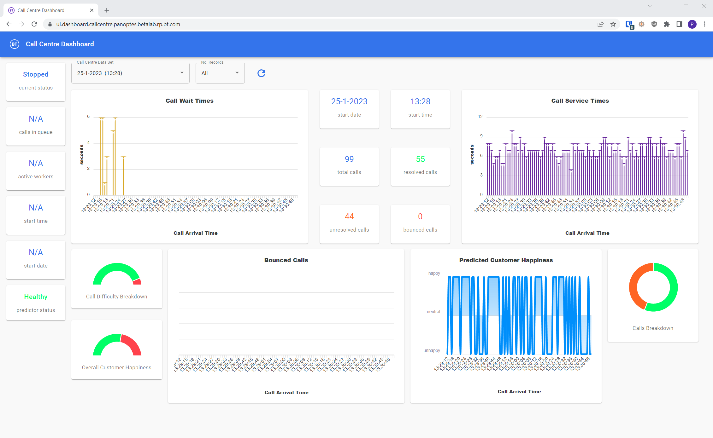
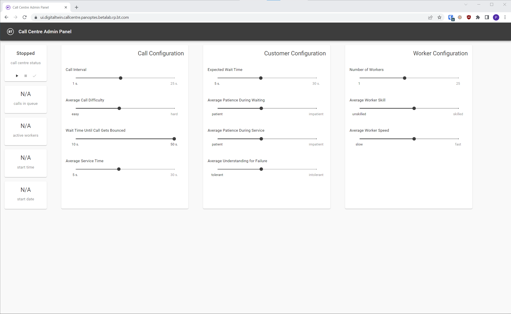

To demonstrate the features of Panoptes we have developed an example application that simulates a call center.

Supposedly, there is a call center that customers can contact when they are having an issue. Initially, the customer is put in a wait queue until a call center worker is available to answer the call. When a worker becomes available, they answer the call and speak with the customer for an amount of time, and then the call ends. There is a chance that the worker is not able to resolve the customer's issue. Based on the interaction, the customer is either happy or not.

After the end of each call, the system requests a prediction about the customer's happiness from an endpoint that hosts a trained ML model. The prediction input is the wait time, the service time, and whether the customer's issue was resolved or not.

The purpose of this example system is to adjust the various simulation variables to introduce dataset shift/affect the performance of the model and then see if we can use Panoptes to detect that and apply corrective measures.

The following are the two user interfaces that you can use to interact with the application.

## User Dashboard
The user dashboard can be accessed [here](http://ui.dashboard.callcentre.panoptes.uk).
In the user dashboard, one can see information about every call center simulation that has been run so far.

In the various widgets included in the user dashboard we can see the following:
- A time-series graph with the wait time of each call
- A time-series graph with the service time of each call
- Information about the total calls in the simulation run we are seeing with a breakdown between calls with resolved and unresolved issues
- Importantly, a graph with the predicted customers' happiness from the deployed ML model. We can click on that to also see the actual happiness of the customer for each call.
- The predictor status widget can also be clicked to show the results of every dataset shift detection execution so far.

## Simulation Dashboard
The simulation dashboard can be accessed [here](http://ui.digitaltwin.callcentre.panoptes.uk).
In the simulation dashboard, one can start and stop simulation runs with specific configurations.

Here is what the various sliders mean:

### Call Configuration
- Call interval: How quickly new calls are being made to our call center
- Average Call Difficulty: Affects the ratio of easy to hard calls. Hard calls are more likely to be left unresolved and that will affect the customer's happiness.
- Wait Time Until Call Gets Bounced: How long customers are willing to wait in the queue before deciding to hang up.
- Average Service Time: How long customers speak to the call center worker after waiting in the queue.

### Customer Configuration
- Expected Wait Time: The customers' expectations regarding wait times. If their actual wait time exceeds their expectations they are more likely to be left unhappy.
- Average Patience During Waiting: Extra parameter that influences whether customers are willing to accept long waiting times.
- Average Patience During Service: Parameter that influences whether customers are willing to accept long service times.
- Average Understanding for Failure: Parameter that influences how likely it is for customers to be left unhappy if their issue is left unresolved after calling.

### Worker Configuration
- Number of Workers: More call center workers will result in lower waiting times for customers.
- Average Worker Skill: Ratio of skilled to unskilled workers. Skilled workers are more likely to resolve customers' issues.
- Average Worker Speed: Ratio of fast to slow workers. Fast workers finish the average call quicker resulting in lower service times.

