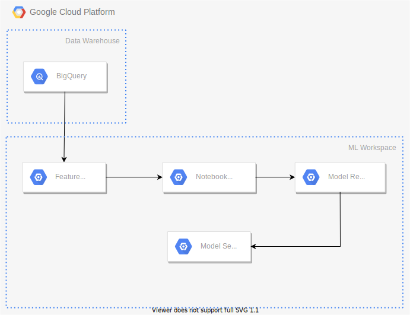

# What is Panoptes?
Panoptes is a low-code platform that helps you monitor the performance of deployed ML models. It does so by providing a coordination layer on top of your existing infrastructure so it can work on-prem or in the cloud provider of your choice.

Data scientists can interact with Panoptes via Panoptes Description Language (PDL). Using PDL, data scientists can define how they would like their ML models to be monitored without worrying about infrastructure-specific technical details. More details about PDL can be found in the [syntax section](syntax). 

# How does it work?
To help us understand the inner workings of Panoptes, let's first look at a relatively simple set of resources being used to train ML models and serve their predictions.

The figure demonstrates a scenario where we:
- Pull raw data from BigQuery.
- Extract our features and store them in a feature store.
- Pull our feature data into a notebook server to train our ML model.
- Push the resulting ML model artifact to a model registry.
- Pull the ML model artifact into a model server and start serving inference requests

Now imagine that for every 1000 inference requests served, we would like to execute an algorithm that checks that the statistical distribution of newly received features closely follows the distribution seen in the training set. In case a distribution shift is observed, we would like to receive an email notification so we can investigate further. In order to implement this functionality, we would have to either develop it from scratch, which would require considerable effort or use a managed service that might not exactly fit our requirements and would also lock us into a specific platform.

Panoptes bypasses this problem by providing an abstraction layer on top of the infrastructure that can be configured via an easy-to-use domain-specific language, PDL. In the figure below, we can see the additional components that are added to the infrastructure of our example.

The main component of Panoptes is the orchestrator. This is the component responsible for parsing the PDL script provided by the data scientist and interfacing with the infrastructure to implement the behavior specified in it.

In our example, the orchestrator needs to interact with the infrastructure in the following ways:
- Receive an event every time an inference request is served.
- Have a way to execute the shift-detecting algorithm.
- Have a way to send out email notifications in case shift is observed.