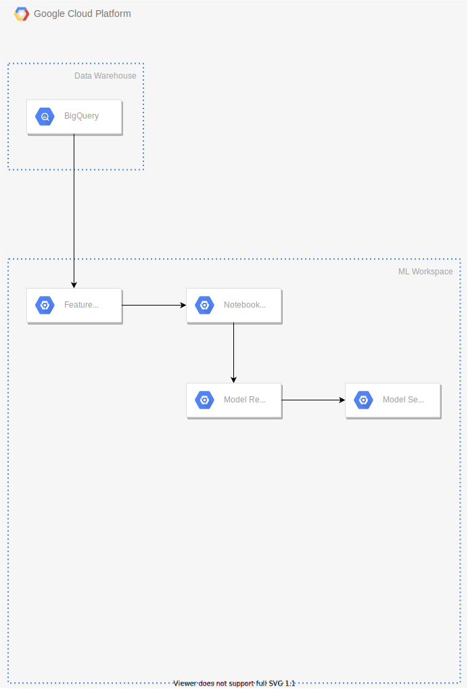

# What is Panoptes?
Panoptes is a low-code platform that helps you monitor the performance of deployed ML models. It does so by providing a coordination layer on top of your existing infrastructure so it can work on-prem or in the cloud provider of your choice.

Data scientists can interact with Panoptes via Panoptes Description Language (PDL). Using PDL, data scientists can define how they would like their ML models to be monitored without having to worry about infrastructure-specific technical details. More details about PDL can be found in the [syntax section](syntax). 

# How does it work?
To help us understand the inner workings of Panoptes, let's first take a look at a relatively simple set of resources being used to train ML models and serve their predictions.

